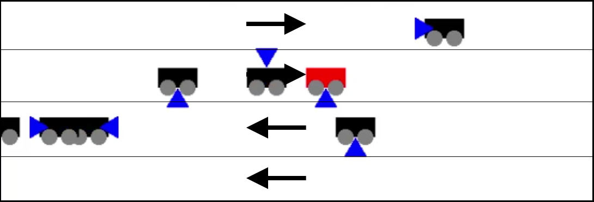
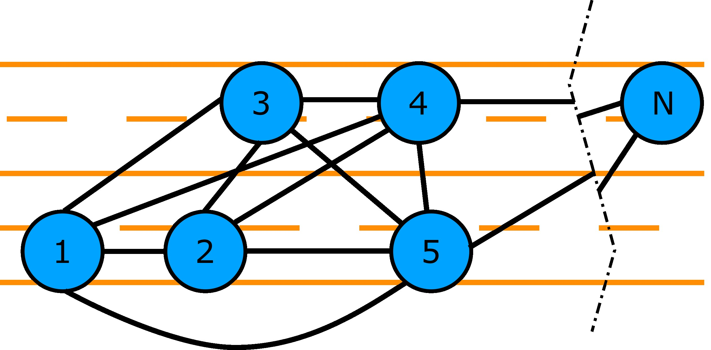
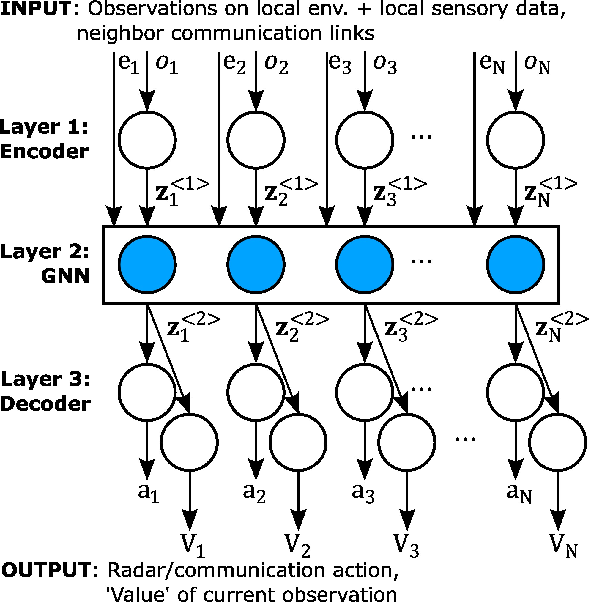

# Scheduling Directional Joint Radar-Communication

Supplementary material for the following paper:
  
- J. Lee, Y. Cheng, D. Niyato, Y. L. Guan and G. David González, "[Deep Reinforcement Learning for Time Allocation and Directional Transmission in Joint Radar-Communication](https://ieeexplore.ieee.org/abstract/document/9771580)," 2022 IEEE Wireless Communications and Networking Conference (WCNC), 2022, pp. 2559-2564, doi: 10.1109/WCNC51071.2022.9771580.

   Also available on [Digital Repository of NTU](https://hdl.handle.net/10356/155437).
   
- J. Lee, Y. Cheng, D. Niyato, Y. L. Guan and D. González G., "[Intelligent Resource Allocation in Joint Radar-Communication With Graph Neural Networks](https://ieeexplore.ieee.org/document/9921194)," in IEEE Transactions on Vehicular Technology, vol. 71, no. 10, pp. 11120-11135, Oct. 2022, doi: 10.1109/TVT.2022.3187377.

Autonomous vehicles produce high data rates of sensory information from sensing systems. To achieve the advantages of sensor fusion among different vehicles in a cooperative driving scenario, high data-rate communication becomes essential. Current strategies for joint radar-communication (JRC) often rely on specialized hardware, prior knowledge of the system model, and entail diminished capability in either radar or communication functions. In this paper, we propose a framework for intelligent vehicles to conduct JRC, with minimal prior knowledge of the system model and a tunable performance balance, in an environment where surrounding vehicles execute radar detection periodically, which is typical in contemporary protocols. We introduce a metric on the usefulness of data to help an intelligent vehicle decide what, and to whom, data should be transmitted. The problem framework is cast as a generalized form of the Markov Decision Process (MDP). We identify deep reinforcement learning algorithms (DRL) and algorithmic extensions suitable for solving our JRC problem. For multi-agent scenarios, we introduce a Graph Neural Network (GNN) framework via a control channel. This framework enables modular and fair comparisons of various algorithmic extensions. Our experiments show that DRL results in superior performance compared to non-learning algorithms. Learning of inter-agent coordination in the GNN framework, based only on the Markov task reward, further improves performance.

## Getting Started
Install the dependencies listed in `requirements.txt`.

## The JRC "Game" Environment
Intelligent vehicles with JRC functionalities traverse through the simulated dual carriageway setting as programmed in `beamformJRCenv.py`. For any experiments run in this environment, real-time animation can be turned on by setting the `--render` flag.

<p align="center">
    
</p>

## Running Experiments

### Single-Agent Problems
Experiments may be run from the command line. Files for the single-agent problems may be found in the folder titled "[Single-Agent](Single-Agent)".

Agents using the "Heuristic" or "Round Robin" policies can be run using the examples below:

Heuristic
```
python test_beamformJRC_multi.py beamform_JRC_4lane --w_comm 1 --w_rad 8 --num_lanes 4 --num_users_NN 8 --num_agents 1 --mode heuristic --age_max 8 --ang_range 35 --x_dim 150 160 10 -ep 400 -n 500 -b 2000 -e 3 --CW 2 4 --exp_name test_heuristic
```

Round Robin
```
python test_beamformJRC_multi.py beamform_JRC_4lane --w_comm 1 --w_rad 8 --num_lanes 4 --num_users_NN 8 --num_agents 1 --mode rotate --age_max 8 --ang_range 35 --x_dim 150 160 10 -ep 400 -n 500 -b 2000 -e 3 --CW 2 4 --exp_name test_round_robin
```

Train an agent using the deep reinforcement learning algorithms Advantage Actor-Critic (A2C) or Proximal Policy Optimisation (PPO) using the examples below:

A2C:
```
python trainA2C_JRC.py beamformJRC_4lane --w_comm 1 --w_rad 8 --num_lanes 4 --num_users_NN 8 --num_users 8 --num_intelligent 1 --num_agents 1 --mode rotate --age_max 8 --ang_range 35 --x_dim 150 160 10 -s 64 64 -sc 64 64 -dc -ep 400 -n 500 -b 2000 -e 3 -lr 0.0001 --entrop_loss_coef 0.01 --ob_time --exp_name A2C_8vehicles
```

PPO:
```
python trainPPO_JRC.py beamformJRC_4lane --w_comm 1 --w_rad 8 --num_lanes 4 --num_users_NN 8 --num_users 8 --num_intelligent 1 --num_agents 1 --mode rotate --age_max 8 --ang_range 35 --x_dim 150 160 10 -s 64 64 -sc 64 64 -dc -ep 400 -n 500 -b 2000 -e 3 -lr 0.0001 --entrop_loss_coef 0.01 --ob_time --exp_name PPO_8vehicles
```

### Multi-Agent Problems
In the extended multi-agent scenario, the vehicular network may be represented as a graph. We consequently apply the GNN architecture as shown.

<p align="center">
    
</p>

Files for the multi-agent problems may be found in the folder titled "[Multi-Agent-GNN](Multi-Agent-GNN)".

Heuristic
```
python test_beamformJRC_multi.py beamform_JRC_multi --w_comm 1 --w_rad 6 --num_lanes 4 --num_users_NN 8 --num_agents 1 --interference --mode heuristic --age_max 8 --ang_range 45 --x_dim 150 160 10 -ep 400 -n 7000 -b 1200 -e 5 --CW 2 4 --exp_name test
```

Round Robin
```
python test_beamformJRC_multi.py beamform_JRC_multi --w_comm 1 --w_rad 6 --num_lanes 4 --num_users_NN 8 --num_agents 1 --interference --mode rotate --age_max 8 --ang_range 45 --x_dim 150 160 10 -ep 400 -n 7000 -b 1200 -e 5 --CW 2 4 --exp_name test
```

A2C:
```
python trainA2C_GCN_JRC.py beamform_JRC_multi --gnn 2 --knn 8 --w_comm 1 --w_rad 6 --num_lanes 4 --num_users_NN 8 --num_intelligent 8 --num_agents 1 --interference --mode rotate --age_max 8 --ang_range 45 --x_dim 150 160 10 -s 64 64 -sc 64 64 -ep 400 -n 7000 -b 1200 -mb 1200 -e 1 -lr 0.0001 --entrop_loss_coef 0.01 --ppo_epochs 1 --ob_time --exp_name A2C_SNR_GCN_bs1200_n7000
```

PPO:
```
python trainPPO_GCN_JRC.py beamform_JRC_multi --gnn 2 --knn 8 --w_comm 1 --w_rad 6 --num_lanes 4 --num_users_NN 8 --num_intelligent 8 --num_agents 1 --interference --mode rotate --age_max 8 --ang_range 45 --x_dim 150 160 10 -s 64 64 -sc 64 64 -ep 400 -n 7000 -b 1200 -mb 1200 -e 2 --seed 31 -lr 0.0001 --entrop_loss_coef 0.01 --ppo_epochs 1 --ob_time --exp_name PPO_SNR_GCN_bs1200_n7000
```

#### Flags Explained

`--recurrent`		: use recurrent GRU neurons in the first hidden layer of the policy and value neural networks

`--ic3net`			: enable neighbour-selection in the GNN framework

`--gnn_pooling transformer`	: use scaled dot-product attention as the message-pooling function in the GNN

`-- knn [-]`		: set the number of neighbours each agent exchanges messages with in the GNN framework. For independent learning, we set `-knn 0`